# 数字图像处理报告

## 摘要：

本文将利用VS平台和c++ 以及Opencv开源库对图像进行一系列操作，包括含边缘检测和基于霍夫变换的直线检测。

## 实验题目：直线检测

### 1.canny边缘检测基本原理

Canny 的目标是找到一个最优的[边缘检测](https://baike.baidu.com/item/%E8%BE%B9%E7%BC%98%E6%A3%80%E6%B5%8B)算法，最优边缘检测的含义是：

(1)最优检测：算法能够尽可能多地标识出图像中的实际边缘，漏检真实边缘的概率和误检非边缘的概率都尽可能小；

(2)最优定位准则：检测到的边缘点的位置距离实际边缘点的位置最近，或者是由于噪声影响引起检测出的边缘偏离物体的真实边缘的程度最小；

(3)检测点与边缘点一一对应：算子检测的边缘点与实际边缘点应该是一一对应。

Canny边缘检测算法可以分为以下5个步骤：

1）应用高斯滤波来平滑图像，目的是去除噪声。

2）找寻图像的强度梯度（intensity gradients）。

3）非最大抑制（non-maximum suppression）技术来消除边误检（本来不是但检测出来是）。

4）应用双阈值的方法来决定可能的（潜在的）边界。

5）利用滞后技术来跟踪边界。

### 2.Sobel edge detector原理

 

#### 3.hough变换原理

霍夫变换(Hough Transform)是图像处理中的一种特征提取技术，可以识别图像中的几何形状。它将图像空间中的特征点映射到参数空间进行投票，通过检测累计结果的局部极值点得到一个符合某特定形状的点的集合。经典霍夫变换用来检测图像中的直线，后来霍夫变换扩展到任意形状物体的识别，多为圆和椭圆。它的抗噪声、抗形变能力较强。另一种直线提取的方法是对图像边缘点进行链码追踪，在得到的链码串中提取直线。

霍夫变换将在一个空间中具有相同形状的曲线或直线映射到另一个坐标空间的一个点上形成峰值，从而把检测任意形状的问题转化为统计峰值问题。

标准霍夫变换：

考虑点和线的对应关系，过一点（x1,y1）的直线可表示为：y1=kx1+b，将变量和参数互换，已知一个点(x1,y1),经过这一点的直线簇可以表示为b=(-x1)k+y1。位于同一条直线上的点具有相同的斜率和截距，反映到参数空间上就是这些直线会交于同一点(k,b)。

举个例子：图像空间有三个点（1，1），（2，2），（3，3），他们在直线y=1*x+0上，如下图所示

 

互换参数，在参数空间里这三个点对应三条直线：1=k+b,2=2*k+b,3=3*k+b，交于同一点（1，0），这一点即图像空间中直线的斜率和截距，如果我们能得到这些点，也就得到了图像空间的直线：

 

由于上面的变换不能表示斜率为无穷大的情况，因此，采用极坐标的方式：Rho = X * Cos(Theta) + Y * Sin(Theta)：

 

### 3.实验结果

此次使用的是opencv自带函数：

 void HoughLinesP(InputArray image, 
                  double rho, 
                  double theta, 
                  int threshold, 
                  double minLineLength=0, double maxLineGap=0 )

第一个参数，InputArray类型的image，输入图像，即源图像，需为8位的单通道二进制图像。 
  第二个参数，InputArray类型的lines，经过调用HoughLinesP函数后后存储了检测到的线条的输出矢量，每一条线由具有四个元素的矢量(x_1,y_1, x_2, y_2） 表示，其中，(x_1, y_1)和(x_2, y_2) 是是每个检测到的线段的结束点。 
  第三个参数，double类型的rho，以像素为单位的距离精度。另一种形容方式是直线搜索时的进步尺寸的单位半径。 
  第四个参数，double类型的theta，以弧度为单位的角度精度。另一种形容方式是直线搜索时的进步尺寸的单位角度。 
  第五个参数，int类型的threshold，累加平面的阈值参数，即识别某部分为图中的一条直线时它在累加平面中必须达到的值。大于阈值threshold的线段才可以被检测通过并返回到结果中。 
  第六个参数，double类型的minLineLength，有默认值0，表示最低线段的长度，比这个设定参数短的线段就不能被显现出来。 

  第七个参数，double类型的maxLineGap，有默认值0，允许将同一行点与点之间连接起来的最大的距离。

注意：因为参数过多，下图片只有一部分实验参数

#### hough变换参数：threshold=10，minLineLength=10，maxLineGap=0

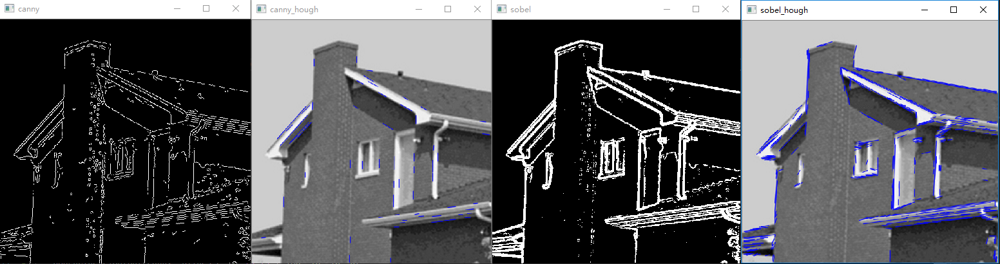

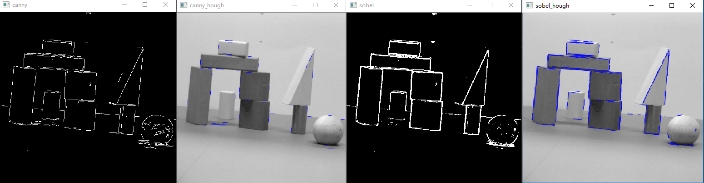

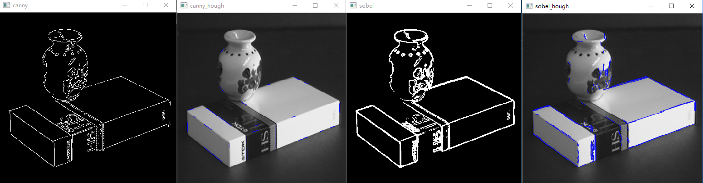

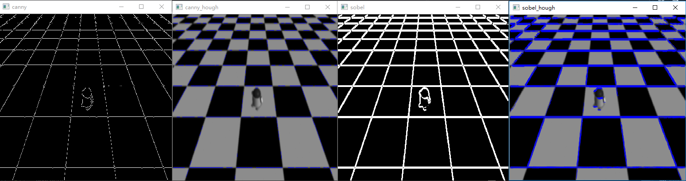

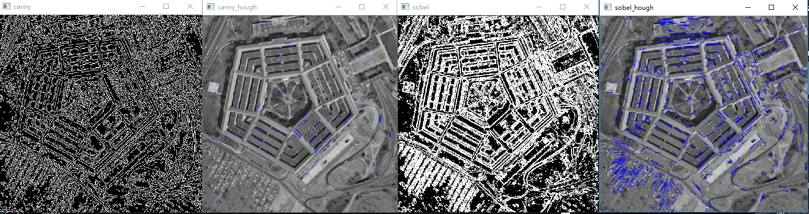

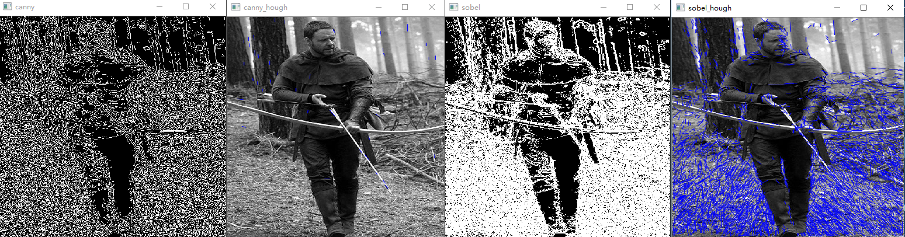

#### hough变换参数：threshold=70，minLineLength=100,maxLineGap=5

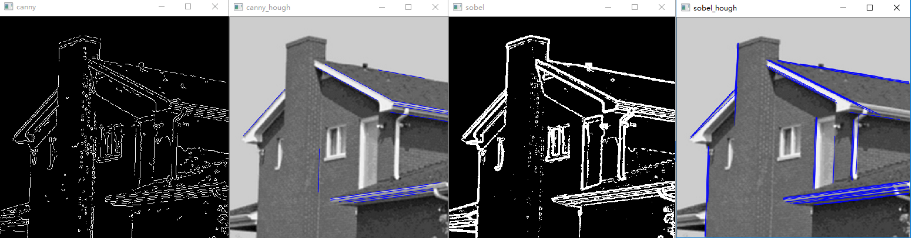

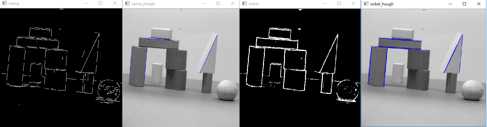

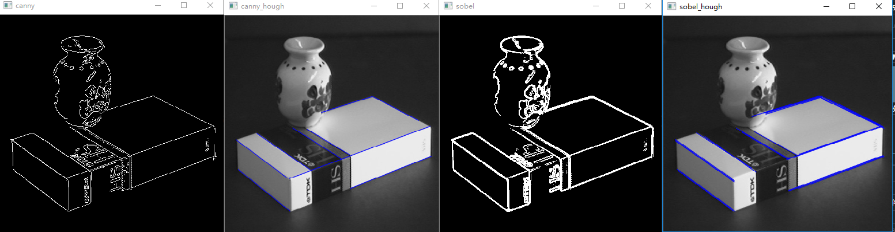

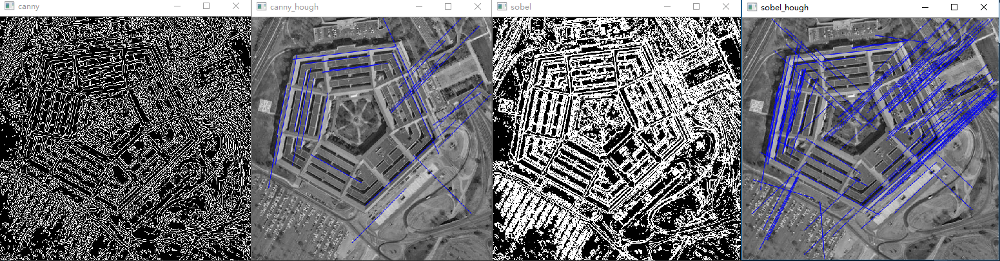

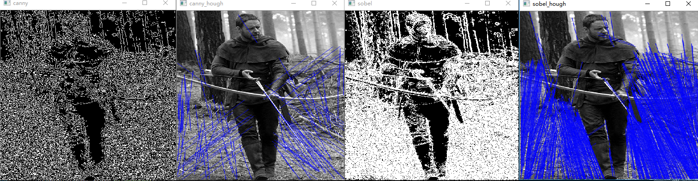

#### 各张图比较好的参数(hough从左到右和上文一样，并加了canny参数）

hough:（70,70,10)canny:(20,80)

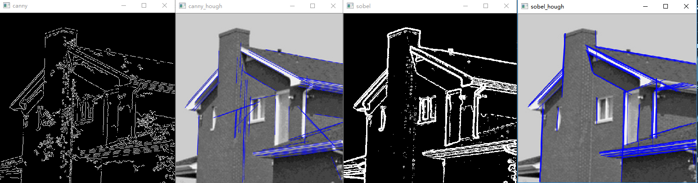

hough:（70,70,10)canny:(20,100)

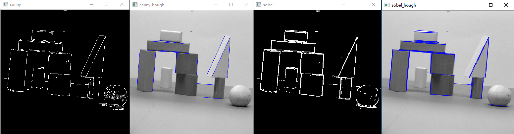

hough:（70,100,10)canny:(20,100)

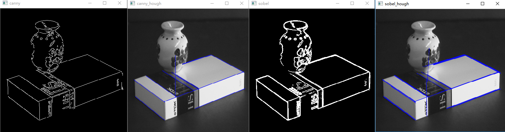

hough:（70,100,10)canny:(20,100)

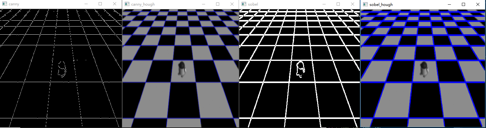

hough:（100,20,5)canny:(20,100)

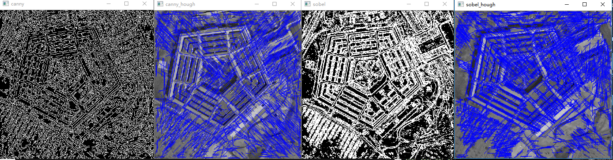

hough:（10,10,0)canny:(50,80)

### 4.结果分析

   从图可以看到，因为每张图的特性不同，canny和sobel算子的边缘检测和霍夫变换的参数都存在不同，因此调参是个比较复杂的过程。经过实验总体发现，canny边缘提取的边缘更加细致，而sobel算子提取出的边缘虽然更加符合人眼视觉，但是对于计算机来说有些粗糙。同时hough变换的threhold和maxLineGap同时影响着检测出来的直线的数量，threhold小直线较多，maxlinegap小直线较少，而minLineLength则决定了检测出来直线的长度。

## 参考文献：

1.https://blog.csdn.net/u014485485/article/details/78608967 

2.https://blog.csdn.net/chenyukuai6625/article/details/74839793 

